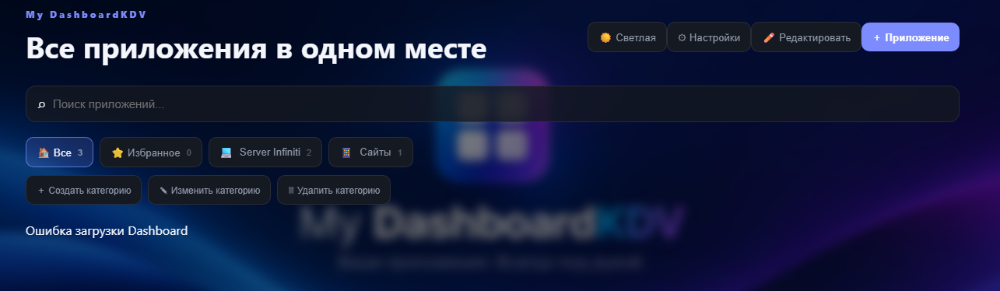

# My DashboardKDV

**My DashboardKDV** — персональная веб-панель для удобного запуска и организации приложений и сервисов в одном месте.

## Версия

**My DashboardKDV 2.9.0**

В 2.7.x–2.8.x были добавлены настройка масштаба фона плитки и полное сохранение данных панели: данные приложений и категорий, порядок, избранное, режимы открытия, размеры и оформление плиток, фон панели, локальные иконки, фоновые изображения плиток и выбранная тема. Локальные изображения включаются в экспорт настроек, поэтому их можно переносить вместе с конфигурацией. Встроенные приложения и авторизация mStream продолжают работать через same-origin reverse proxy.


## Пример страницы приложения

Ниже показан пример главной страницы My DashboardKDV с категориями и плитками приложений:




## Возможности

- 📱 Добавление, редактирование и удаление приложений.
- 🗂️ Создание, редактирование и удаление категорий.
- ⭐ Избранные приложения.
- 🔎 Поиск по панели.
- ↕️ Drag & Drop и режим редактирования расположения плиток.
- 📐 Индивидуальный размер каждой плитки.
- 🎨 Индивидуальная настройка внешнего вида плитки.
- 📝 Отдельный цвет названия, описания и URL.
- 👁️ Включение/выключение описания и URL.
- 😀 Emoji для приложений и категорий.
- 🖼️ Иконки из локального файла.
- 🌐 Иконки по URL.
- 🔎 Автоматическое получение favicon.
- 🖼️ Фон панели: файл или URL.
- 🖼️ Фон отдельных плиток с настройкой масштаба изображения.
- ☀️ Светлая и 🌙 тёмная тема.
- ⚙️ Экспорт и импорт настроек.
- 📺 Интеграция с Emby для отображения состояния и активных сессий.
- 💾 SQLite для хранения данных.
- 🐳 Docker и Docker Compose для установки и запуска.

> Обычная проверка HTTP-статуса приложений в плитках и общий блок проверки статусов удалены. Состояние Emby остаётся отдельной функцией.

## Сохранение всех данных

Постоянное хранилище Dashboard находится в каталоге `data/`. Docker подключает его как постоянный volume:

```yaml
volumes:
  - ./data:/app/data
```

При обычном обновлении контейнера база и загруженные файлы сохраняются. Не удаляйте каталог `data/` при обновлении.

Экспорт настроек дополнительно включает локальные иконки, фон панели и фоновые изображения плиток в JSON. Это позволяет восстановить настройки на другом компьютере без потери локальных изображений. API-ключ Emby не экспортируется и остаётся сохранённым локально в базе Dashboard.

## Размеры плиток

Для каждой плитки можно выбрать размер:

| Размер | Сетка |
|---|---|
| `mini` | 1×1 |
| `small` | 1×1 |
| `medium` | 1×1 |
| `wide` | 2×1 |
| `tall` | 1×2 |
| `large` | 2×2 |
| `xl` | 3×2 |
| `hero` | 3×1 |

Размер применяется только к выбранной плитке.

## Настройка внешнего вида плитки

Для каждой плитки приложения доступны отдельные параметры:

- фон плитки;
- изображение фона;
- масштаб фонового изображения (50–200%);
- прозрачность;
- размытие;
- размер иконки;
- размер названия;
- цвет названия;
- цвет описания;
- цвет URL;
- показ/скрытие описания;
- показ/скрытие URL.

Настройки сохраняются в SQLite и входят в экспорт/импорт панели.

---

# Встроенные приложения

Для локальных веб-приложений доступен режим **«Встроить в Dashboard»**. При нажатии на плитку приложение открывается внутри Dashboard в полноэкранном окне. В окне доступны кнопки **«← Dashboard»**, **«↻ Обновить»** и **«↗ Открыть отдельно»**.

## Пример: mStream Music

Для mStream Music укажите URL самого web-интерфейса. Например, если mStream работает на компьютере с IP `192.168.1.100` и портом `3000`:

```text
http://192.168.1.100:3000
```

В форме добавления приложения:

```text
Название: mStream Music
URL: http://192.168.1.100:3000
Открытие приложения: ▣ Встроить в Dashboard
Категория: Музыка
Иконка: 🎵
```

> Важно: `localhost` относится к компьютеру, на котором открыт браузер. Для доступа к mStream с телефона, телевизора или другого ПК используйте IP-адрес или имя компьютера в локальной сети.

Некоторые веб-приложения могут запрещать показ внутри `iframe` заголовками безопасности. В этом случае используйте **«Открыть отдельно»**.


---

## Встроенные приложения и mStream

В режиме **«▣ Встроить в Dashboard»** веб-приложение открывается через локальный reverse proxy My DashboardKDV. Это важно для приложений с cookie/JWT-аутентификацией, например mStream: mStream выдаёт JWT и принимает его через `x-access-token` cookie, query-параметр или заголовок. Встроенный режим проксирует запросы через тот же origin, поэтому авторизация работает как для обычного first-party приложения.

Для mStream можно указать, например:

```text
http://localhost:3000
```

Для Dashboard в Docker `localhost` автоматически преобразуется в `host.docker.internal`, поэтому локальный mStream на компьютере-хосте доступен из контейнера.

## Автоматическое определение локальных сервисов

В настройках доступен однократный поиск распространённых локальных веб-сервисов на компьютере, где запущен Dashboard. Поиск не является постоянным мониторингом и сам ничего не сохраняет.

Нажмите **🔎 Найти локальные сервисы**. Dashboard проверит небольшой список стандартных HTTP/HTTPS-портов и попытается определить сервис по заголовку страницы и характерным признакам. Найденный сервис можно сразу передать в форму добавления приложения.

Для Docker используется `host.docker.internal`, чтобы Dashboard мог обращаться к веб-сервисам на Docker-хосте.


# Docker Compose

Для обычной установки используется готовый образ из GitHub Container Registry.

## `docker-compose.yml`

Создайте файл `docker-compose.yml` со следующим содержимым:

```yaml
services:
  dashboard:
    image: ghcr.io/podpeedami/my-dashboardkdv:latest
    container_name: my-dashboardkdv
    ports:
      - "8080:8000"
    volumes:
      - ./data:/app/data
    restart: unless-stopped
```

## Запуск

```bash
docker compose pull
docker compose up -d
```

После запуска откройте:

```text
http://localhost:8080
```

## Проверка контейнера

```bash
docker ps
```

## Логи

```bash
docker compose logs -f
```

Последние 200 строк:

```bash
docker compose logs --tail=200
```

## Остановка

```bash
docker compose down
```

## Повторный запуск

```bash
docker compose up -d
```

---

# Быстрая установка

## Требования

- Docker
- Docker Compose

Проверка:

```bash
docker --version
docker compose version
```

## Установка из GitHub

```bash
git clone https://github.com/Podpeedami/My-DashboardKDV.git
cd My-DashboardKDV
docker compose pull
docker compose up -d
```

Открыть:

```text
http://localhost:8080
```

---

# Docker-образ

Используется GitHub Container Registry:

```text
ghcr.io/podpeedami/my-dashboardkdv:latest
```

Для конкретного релиза:

```text
ghcr.io/podpeedami/my-dashboardkdv:v2.5.1
```

Обычная установка через `docker-compose.yml` использует `latest` и не требует локальной сборки проекта.

---

# Данные

Пользовательские данные находятся в каталоге:

```text
data/
├── dashboard.db
├── icons/
├── backgrounds/
└── tile-backgrounds/
```

Docker подключает его:

```yaml
volumes:
  - ./data:/app/data
```

**Не удаляйте каталог `data/`**, если хотите сохранить:

- приложения;
- категории;
- порядок плиток;
- избранное;
- иконки;
- фон панели;
- фон плиток;
- настройки внешнего вида;
- настройки Emby;
- базу SQLite.

---

# Резервная копия

В настройках панели доступны:

- 💾 экспорт настроек;
- 📥 импорт настроек.

Файл экспорта:

```text
My-DashboardKDV-settings.json
```

Перед обновлением рекомендуется сделать резервную копию каталога:

```text
data/
```

---

# Иконки

Для приложения или категории можно использовать:

```text
😀 Emoji
🖼️ Локальный файл
🌐 URL изображения
🔎 Favicon сайта
```

Пользовательские иконки хранятся в:

```text
data/icons/
```

---

# Фон панели

В настройках можно:

- загрузить изображение с компьютера;
- указать URL;
- настроить затемнение;
- удалить фон.

Пользовательские фоны хранятся в:

```text
data/backgrounds/
```

---

# Фон плитки

Для каждой плитки можно выбрать:

- стандартный фон;
- цвет;
- изображение.

Загруженные изображения фона плиток сохраняются отдельно:

```text
data/tile-backgrounds/
```

Это позволяет сохранять фон плиток после перезапуска контейнера.

---

# Темы

Доступны:

```text
☀️ Светлая
🌙 Тёмная
```

---

# Emby

Для подключения Emby откройте настройки My DashboardKDV и укажите адрес сервера и API-ключ.

Пример:

```text
http://192.168.1.100:8096
```

API-ключ Emby не следует публиковать в GitHub или помещать в публичные конфигурационные файлы.

---

# Обновление

Для обновления до последней версии:

```bash
docker compose pull
docker compose down
docker compose up -d
```

Каталог `data/` при этом сохраняется.

После обновления можно выполнить жёсткое обновление страницы браузера:

```text
Ctrl + F5
```

---

# Если порт 8080 занят

Измените внешний порт в `docker-compose.yml`.

Например:

```yaml
ports:
  - "8081:8000"
```

После этого:

```bash
docker compose up -d
```

Панель будет доступна по адресу:

```text
http://localhost:8081
```

---

# Диагностика

Посмотреть все контейнеры:

```bash
docker ps -a
```

Посмотреть логи:

```bash
docker compose logs --tail=200
```

Проверить образ:

```bash
docker pull ghcr.io/podpeedami/my-dashboardkdv:latest
```

Если контейнер уже запущен, проверить:

```bash
docker compose ps
```

---

# GitHub

Репозиторий:

```text
https://github.com/Podpeedami/My-DashboardKDV
```

Основные команды:

```bash
git status
git add .
git commit -m "Update My DashboardKDV"
git push origin main
```

Для релиза:

```bash
git tag -a v2.5.1 -m "My DashboardKDV 2.5.1"
git push origin v2.5.1
```

После отправки тега GitHub Actions создаёт GitHub Release и публикует Docker-образ.

---

# Структура проекта

```text
My-DashboardKDV/
├── app/
│   ├── main.py
│   └── static/
│       ├── index.html
│       ├── app.js
│       └── style.css
├── data/
│   ├── dashboard.db
│   ├── icons/
│   ├── backgrounds/
│   └── tile-backgrounds/
├── .github/
│   └── workflows/
│       ├── docker-image.yml
│       └── release.yml
├── Dockerfile
├── docker-compose.yml
├── docker-compose.build.yml
├── requirements.txt
├── VERSION
├── INSTALL.md
└── README.md
```

---

# Безопасность

Не публикуйте:

- `data/dashboard.db`;
- API-ключ Emby;
- пароли;
- секретные токены;
- приватные резервные копии.

Каталог `data/` должен быть исключён из Git через `.gitignore`.

---

**GitHub:** https://github.com/Podpeedami/My-DashboardKDV  
**Docker:** `ghcr.io/podpeedami/my-dashboardkdv:latest`  
**Версия:** `2.9.0`
